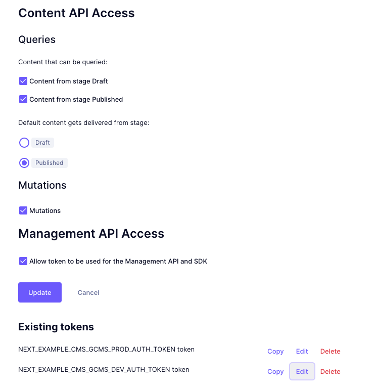

# graphcms-markdown-migrator

This package aims to help the migration from static markdown files to GraphCMS for your blog (or whatever you've built using markdowns).

[GraphCMS is a headless CMS](https://graphcms.com/academy/headless-cms) and allows you to create entities (which are called models) and expose GraphQL mutations and queries to manage them.<br/>
It also gives you an admin UI to create instances of these entities. They also have a [gatsby connector](https://www.gatsbyjs.com/docs/sourcing-from-graphcms/), and therefore it might be just perfect for your blog, whereas you'll have a "Post" entity, and you'll manage your posts in their UI.

## What does this migrator do?

You can give it a folder full of MD files, and it will try to create a "Post" entity on your GraphCMS instance, and it will create as many posts as the number of your MD files with their content in it. (it will recursively find the files between all your folders). It also uploads your media and the thumbnail of every post in the pre-configured Asset model in GraphCMS.
<br/><br/>
**This package will try to recreate the model from the first markdown it encounters.**<br/>
It means that if you have markdowns with different YAML sections, you need to create two separate folders where you'll run this migrator.<br/>

## Prerequisites

- The URL of your GraphCMS instance
- A token with the "Management API Access" turned on.<br/>
  To do this, click first "edit" on the token you chose and then check the boxes like this:



## Usage

Run:

```sh
npx md-to-graphcms --path ./your-path --url https://your-istance.com --token <token>
```

### Options

You can provide the following optional parameters to the CLI:

```
Options:
  -p, --path         Path of the folder of the MD files to migrate.    [stringa]
  -u, --url          Your graphCMS URL                                 [stringa]
  -t, --token        Your graphCMS token                               [stringa]
      --thumb-field  The name of the YAML field to recognize as a post thumbnail
                     (it will upload the thumbnails automatically into the "Asset" model)
                                                                       [stringa]
      --exclude      Comma separated list of fields to exclude from your MDs
                     frontmatter: "field1, field2, field3"             [stringa]
      --model-from   The filename of the specific MD file to use to extract the
                     model (you must add the ".md" extension when specifying it)
                                                                       [stringa]
      --model-name   The name of the model to create in GraphCMS
                     (Defaults to "Post")                              [stringa]
```

### TODO

- Add tests
- Implement auto-publish option
